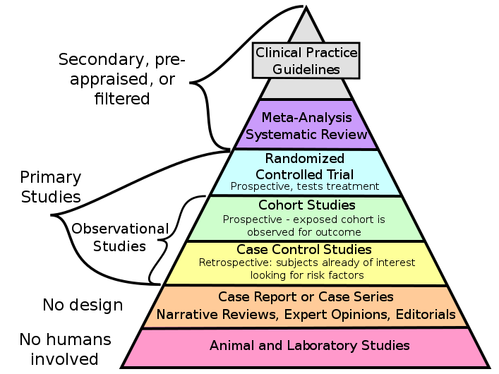

# Meta-analysis-HP
 Code used for a Meta Analysis Of Risk factors for Hypersensitivity Pneumonitis \
 Find the paper here:   https://doi.org/10.1080/17476348.2022.2100352 

# Methodology

### Background: 
Hypersensitivity pneumonitis (HP) related deaths have increased substantially in recent
years. It is important to identify the risk factors of HP significantly associated with mortality to ensure
close patient monitoring and assess disease progression. Research design and methods: Extensive literature search was conducted in accordance with the PRISMA checklist. Literature search of PubMed, Embase, and Cochrane Library database between January 2009 and April 2021 using the terms ‘hypersensitivity pneumonitis’, ‘hazard ratio’, and ‘mortality’ identified 325 articles. A total of 22 independent original studies focusing on mortality of HP
patients were assessed.
### Results: 
This systematic review and meta-analysis suggests that increased age, male sex, honeycomb­
ing, and traction bronchiectasis patterns on high-resolution computed tomography (HRCT) images are
the major mortality-related risk factors of patients with HP. In case of chronic HP, antigen exposure
appeared to be an additional risk factor.
### Conclusions: 

The clinico-radiological risk factors of mortality identified for HP will enable effective and
close monitoring of patients, prognostication, and guide toward appropriate management decisions.
However, association between the type of antigen and mortality remains to be explored.

